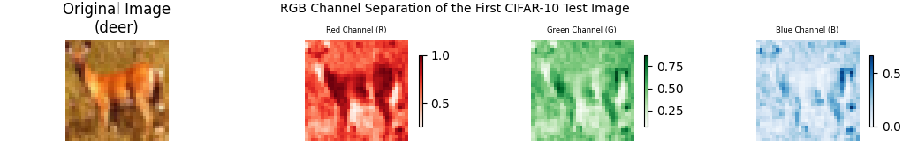
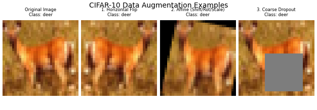
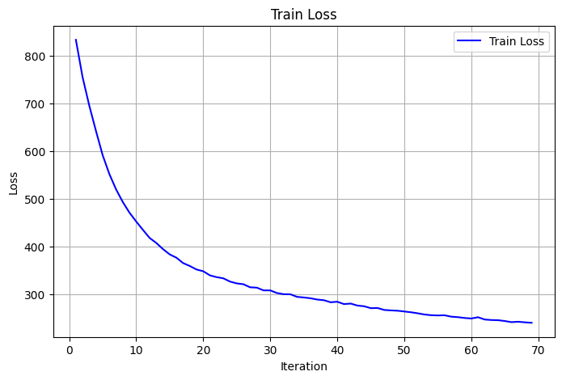
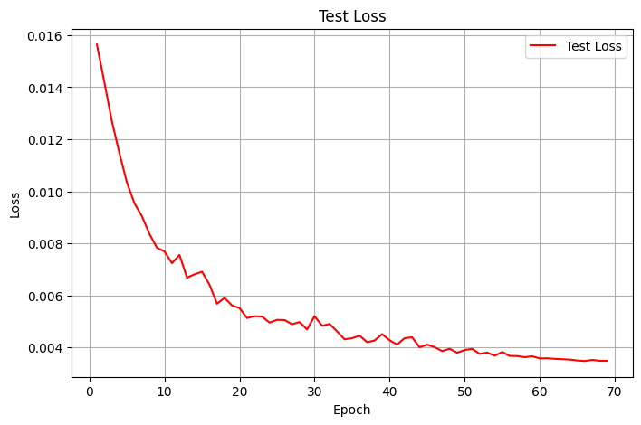
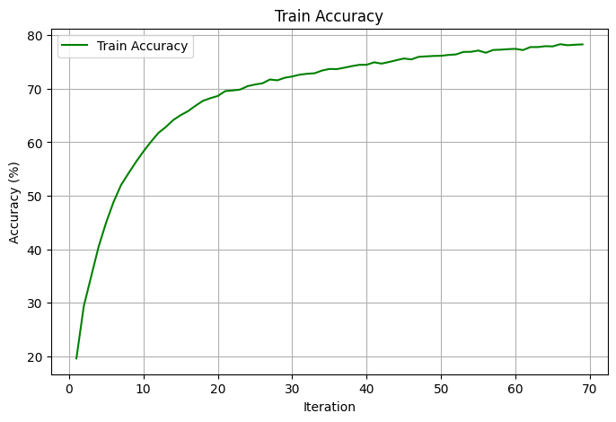
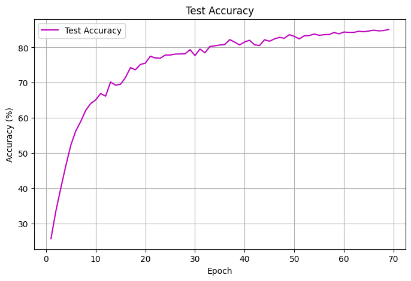

# **CIFAR10 Classification Using Convolutional Neural Network**

## **Objective**
The main objective of this assignment is to create a model consisting of multiple Convolution layers that can accurately classify unseen images from the CIFAR-10 dataset into their respective classes. The network should follow:
- works on CIFAR-10 Dataset
- has the architecture to C1C2C3C40 (No MaxPooling, but convolutions, where the last one has a stride of 2 instead) (NO restriction on using 1x1) (If you can figure out how to use Dilated kernels here instead of MP or strided convolution, then 200pts extra!)
- total RF must be more than 44
- One of the layers must use Depthwise Separable Convolution
- One of the layers must use Dilated Convolution
- use GAP (compulsory):- add FC after GAP to target #of classes (optional)
- Use the albumentation library and apply:
  - horizontal flip
  - shiftScaleRotate
  - coarseDropout (max_holes = 1, max_height=16px, max_width=16, min_holes = 1, min_height=16px, min_width=16px, fill_value=(mean of your dataset), mask_fill_value = None)
- achieve 85% accuracy, as many epochs as you want. Total Params to be less than 200k.

## **Dataset Overview**
The CIFAR-10 dataset contains 60,000 32×32 colored images across 10 classes (6,000 images per class):
- Training set: 50,000 images
- Test set: 10,000 images

```
----------------------------------------
Total images in training dataset: 50000
CIFAR-10 Class Distribution:
----------------------------------------
Class 0 (airplane   ): 5000 images
Class 1 (automobile ): 5000 images
Class 2 (bird       ): 5000 images
Class 3 (cat        ): 5000 images
Class 4 (deer       ): 5000 images
Class 5 (dog        ): 5000 images
Class 6 (frog       ): 5000 images
Class 7 (horse      ): 5000 images
Class 8 (ship       ): 5000 images
Class 9 (truck      ): 5000 images
----------------------------------------
```

## **Data Exploration**
### &emsp; Sample CIFAR10 Image

A typical CIFAR-10 image is a low-resolution, 32×32 pixel color photograph (using 3 RGB channels).




### &emsp; Normalization
Since the images are in color and their pixel brightness values range from 0 (black) to 255 (white) across the Red, Green, and Blue channels, we need to normalize them.

Normalization is essential because it scales these values into a smaller, consistent range, which makes it much easier for the neural network to learn effectively and efficiently during training. To do this correctly for color images, we treat each color channel (Red, Green, Blue) separately. We calculate the average brightness (mean) and spread of brightness (standard deviation) for every single pixel across all 50,000 training images for each channel. These resulting mean and standard deviation values are then used to normalize the entire dataset.


```
============================================================
Calculating Channel Mean and Standard Deviation across all images
============================================================
mean tensor([0.4914, 0.4822, 0.4465])
std tensor([0.2470, 0.2435, 0.2616])
============================================================
```

## **Data Augmentation**
Using albumentation library, three data augmentation techniques were applied randomly on all the training images in order to avoid overfitting and improve testing accuracy.
- horizontal flip
- shiftScaleRotate
- coarseDropout  



This image has the original image along with the augmented ones.


## **Experiments**

Multiple models were tried with different set of parameters.

|Experiment|Notebook|Number of Parameters|Epochs Needed to reach 85%|
|:---:|:---|:---:|:---:|
|1|[First Notebook File](FirstSuccessful.ipynb)|183,882|55|
|2|[Second Notebook File](SecondSuccessful.ipynb)|156,714|49|
|3|[Third Notebook File](ThirdSuccessful.ipynb)|129,002|42|
|4|[Fourth Notebook File](FourthSuccessful.ipynb)|138,282|43|
|5|**[Final Notebook File](FifthSuccessful.ipynb)**|92,394|69|

### &emsp; Analysis
 - **Parameter Reduction Strategy**: Initially, models (Experiments 1-4) were designed with a higher parameter count (up to 183,882). The goal was to ensure the architecture had enough capacity to reach the 85% accuracy target quickly.

 - **Optimization and Trimming**: Once the accuracy target was consistently met, the focus shifted to reducing the total parameters and optimizing the Receptive Field (RF), leading to the Final Architecture (Experiment 5).

 - **Final Efficiency**: The final model achieves the required 85% accuracy with only 92,394 parameters—a reduction of nearly 50% from the first successful attempt. This highlights the effectiveness of using techniques like Depthwise Separable Convolutions to maintain performance while significantly improving model efficiency.

## **Final Architecture**

### &emsp; **Model Summary**

```
----------------------------------------------------------------
        Layer (type)               Output Shape         Param #
================================================================
            Conv2d-1           [-1, 32, 32, 32]             864
       BatchNorm2d-2           [-1, 32, 32, 32]              64
              ReLU-3           [-1, 32, 32, 32]               0
           Dropout-4           [-1, 32, 32, 32]               0
            Conv2d-5           [-1, 64, 16, 16]          18,432
       BatchNorm2d-6           [-1, 64, 16, 16]             128
              ReLU-7           [-1, 64, 16, 16]               0
           Dropout-8           [-1, 64, 16, 16]               0
            Conv2d-9           [-1, 16, 16, 16]           1,024
      BatchNorm2d-10           [-1, 16, 16, 16]              32
             ReLU-11           [-1, 16, 16, 16]               0
          Dropout-12           [-1, 16, 16, 16]               0
           Conv2d-13           [-1, 32, 16, 16]           4,608
      BatchNorm2d-14           [-1, 32, 16, 16]              64
             ReLU-15           [-1, 32, 16, 16]               0
          Dropout-16           [-1, 32, 16, 16]               0
           Conv2d-17             [-1, 32, 8, 8]             288
           Conv2d-18             [-1, 16, 8, 8]             512
      BatchNorm2d-19             [-1, 16, 8, 8]              32
             ReLU-20             [-1, 16, 8, 8]               0
          Dropout-21             [-1, 16, 8, 8]               0
           Conv2d-22             [-1, 32, 8, 8]           4,608
      BatchNorm2d-23             [-1, 32, 8, 8]              64
             ReLU-24             [-1, 32, 8, 8]               0
          Dropout-25             [-1, 32, 8, 8]               0
           Conv2d-26             [-1, 64, 8, 8]          18,432
      BatchNorm2d-27             [-1, 64, 8, 8]             128
             ReLU-28             [-1, 64, 8, 8]               0
          Dropout-29             [-1, 64, 8, 8]               0
           Conv2d-30             [-1, 16, 8, 8]           1,024
      BatchNorm2d-31             [-1, 16, 8, 8]              32
             ReLU-32             [-1, 16, 8, 8]               0
          Dropout-33             [-1, 16, 8, 8]               0
           Conv2d-34             [-1, 32, 8, 8]           4,608
      BatchNorm2d-35             [-1, 32, 8, 8]              64
             ReLU-36             [-1, 32, 8, 8]               0
          Dropout-37             [-1, 32, 8, 8]               0
           Conv2d-38             [-1, 64, 8, 8]          18,432
      BatchNorm2d-39             [-1, 64, 8, 8]             128
             ReLU-40             [-1, 64, 8, 8]               0
          Dropout-41             [-1, 64, 8, 8]               0
           Conv2d-42             [-1, 32, 6, 6]          18,432
      BatchNorm2d-43             [-1, 32, 6, 6]              64
             ReLU-44             [-1, 32, 6, 6]               0
          Dropout-45             [-1, 32, 6, 6]               0
AdaptiveAvgPool2d-46             [-1, 32, 1, 1]               0
           Linear-47                   [-1, 10]             330
================================================================
Total params: 92,394
Trainable params: 92,394
Non-trainable params: 0
----------------------------------------------------------------
Input size (MB): 0.01
Forward/backward pass size (MB): 2.36
Params size (MB): 0.35
Estimated Total Size (MB): 2.73
----------------------------------------------------------------
```

### &emsp; **Network Main Features**
- The network has four convolution blocks and a output block.
- In Block 2, a **Depthwise Separable Convolution** is used. This technique has significantly reduced the total number of parameters.
- The feature map size is halved twice using convolutions with a **stride of 2** (c1_2 and c2_2), reducing the spatial size from 32×32 to 8×8
- The final convolutional layer (c5) uses a **Dilated Convolution** with a dilation rate of 2. This allows the last layer to see a much larger context of the image without further downsampling, ensuring the feature maps are based on information from the entire 32×32 input image (Receptive Field of 61).

### &emsp; **Receptive Field Calculation Table for the final model (CIFAR-10)**

***

This table tracks the Receptive Field (RF) size and the feature map dimensions (Output Size) throughout this model, assuming a $\mathbf{32 \times 32}$ CIFAR10 input image which has 3 input channels.

| **Block** | **Layer** | **Input Size (HxW)** | **Output Size (HxW)** | **Input Channels** | **Output Channels** | **Receptive Field (RF)** | **Details** |
|:---:|:---|:---:|:---:|:---:|:---:|:---:|:---|
| **Input** | **Input** | 32x32 | 32x32 | 3 | 3 | **1** | Initial image |
| $\text{B1}$ | **c1\_1** | 32x32 | 32x32 | 3 | 32 | **3** | $k=3, S=1, P=1, D=1$ |
| $\text{B1}$ | **c1\_2** | 32x32 | **16x16** | 32 | 64 | **5** | $k=3, S=2, P=1, D=1$ (Downsampling) |
| $\text{B1}$ | **onexonec1\_1** | 16x16 | 16x16 | 64 | 16 | **5** | $k=1, S=1, P=0, D=1$ (Channel Reduction) |
| --- | --- | --- | --- | --- | --- | --- | --- |
| $\text{B2}$ | **c2\_1** | 16x16 | 16x16 | 16 | 32 | **9** | $k=3, S=1, P=1, D=1$ |
| $\text{B2}$ | **c2\_2 (DW)** | 16x16 | **8x8** | 32 | 32 | **13** | $k=3, S=2, P=1, D=1$ (Depthwise + Downsampling) |
| $\text{B2}$ | **c2\_2 (PW)** | 8x8 | 8x8 | 32 | 16 | **13** | $k=1, S=1, P=0, D=1$ (Pointwise) |
| --- | --- | --- | --- | --- | --- | --- | --- |
| $\text{B3}$ | **c3\_1** | 8x8 | 8x8 | 16 | 32 | **21** | $k=3, S=1, P=1, D=1$ |
| $\text{B3}$ | **c3\_2** | 8x8 | 8x8 | 32 | 64 | **29** | $k=3, S=1, P=1, D=1$ |
| $\text{B3}$ | **onexonec3\_1** | 8x8 | 8x8 | 64 | 16 | **29** | $k=1, S=1, P=0, D=1$ (Channel Reduction) |
| --- | --- | --- | --- | --- | --- | --- | --- |
| $\text{B4}$ | **c4\_1** | 8x8 | 8x8 | 16 | 32 | **37** | $k=3, S=1, P=1, D=1$ |
| $\text{B4}$ | **c4\_2** | 8x8 | 8x8 | 32 | 64 | **45** | $k=3, S=1, P=1, D=1$ |
| $\text{B4}$ | **c5 (Dilated)** | 8x8 | 8x8 | 64 | 32 | **61** | $k=3, S=1, P=1, \mathbf{D=2}$ (RF expanded) |
| **Output** | **GAP** | 8x8 | 1x1 | 32 | 32 | **61** | Global Average Pooling |
| **Output** | **FC** | 1x1 | 1x1 | 32 | 10 | **61** | Classification |


### &emsp; **Training Logs**

```
...
...
...

EPOCH: 66
Epoch=66 Loss=0.5377 Accuracy=78.33: 100%|██████████| 391/391 [00:20<00:00, 18.90it/s]

Test set: Average loss: 0.0035, Accuracy: 8491/10000 (84.91%)

found perfect model!!
Saved best model (acc=84.91%) to best_model.pth

EPOCH: 67
Epoch=67 Loss=0.4668 Accuracy=78.14: 100%|██████████| 391/391 [00:20<00:00, 19.28it/s]

Test set: Average loss: 0.0035, Accuracy: 8472/10000 (84.72%)


EPOCH: 68
Epoch=68 Loss=0.4888 Accuracy=78.24: 100%|██████████| 391/391 [00:19<00:00, 20.36it/s]

Test set: Average loss: 0.0035, Accuracy: 8480/10000 (84.80%)


EPOCH: 69
Epoch=69 Loss=0.4606 Accuracy=78.29: 100%|██████████| 391/391 [00:20<00:00, 19.22it/s]

Test set: Average loss: 0.0035, Accuracy: 8513/10000 (85.13%)

found perfect model!!
Saved best model (acc=85.13%) to best_model.pth
 ```

For complete logs please check [Final Notebook File](FifthSuccessful.ipynb)

### &emsp; **Training Graphs**
<table width="100%">
  <tr>
    <td width="50%" align="center">
      
      <br>
      **Figure 1: Training Loss**
    </td>
    <td width="50%" align="center">
      
      <br>
      **Figure 2: Testing Loss**
    </td>
  </tr>
  <tr>
    <td width="50%" align="center">
      
      <br>
      **Figure 3: Training Accuracy**
    </td>
    <td width="50%" align="center">
      
      <br>
      **Figure 4: Testing Accuracy**
    </td>
  </tr>
</table>

## Conclusion

- **Constraint Satisfaction**: The final model meets all assignment requirements:
  - **Accuracy**: Achieved 85.13% test accuracy in 69 epochs.
  - **Parameters**: The model is highly efficient, using only **92,394** parameters, well under the 200k limit.
  - **RF**: The Receptive Field is **61**, satisfying the >44 requirement.
  - **Architecture**: It correctly uses Depthwise Separable and Dilated Convolutions for efficient feature extraction.
- Use of **Albumentation** for data augmentation and **dropout** of 0.1 helped the model learn better and avoid overfitting. 